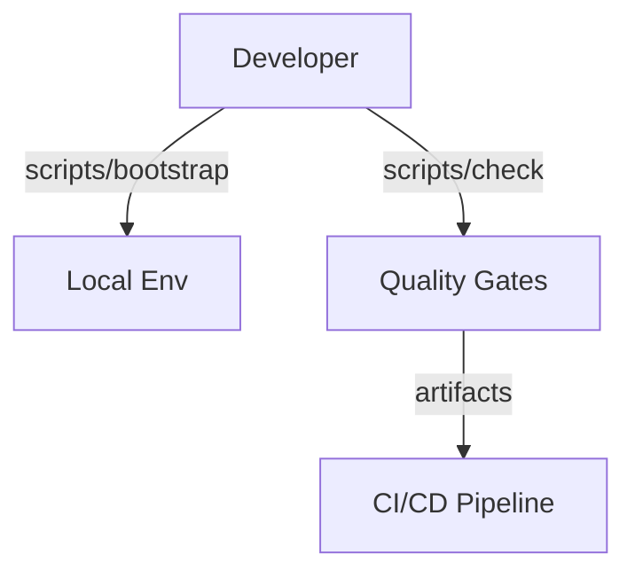

# ADR 0001: Repository Standardization

- **Status:** Accepted
- **Date:** 2024-01-01

## Context

The original repository mixed runtime modules, tests, configuration, and documentation at the top level. Tooling scripts were ad hoc and environment bootstrap instructions had diverged across contributors. This made onboarding difficult and prevented CI/CD automation from enforcing consistent quality gates.

## Decision

We adopted a canonical layout centered on a `src/` based Python package, a normalized `tests/` hierarchy (`unit/`, `integration/`, `e2e/`), and a shared scripts toolbelt surfaced through a unified `Makefile`. Supporting assets (configuration, docs, infrastructure templates, data stubs, and assets) now live in dedicated top-level folders. Quality tooling is configured via `pyproject.toml`, `.pre-commit-config.yaml`, and GitHub Actions that delegate to `make check`.

A `project.yaml` metadata file captures ownership, runtime versions, and entrypoints so external automation can reason about the service contract. Environment management follows Twelve-Factor practices via `.env.example`.

## Consequences

- Contributors get a deterministic workflow: `scripts/bootstrap` provisions dependencies and `scripts/check` mirrors CI.
- CI/CD gains a consistent interface for linting, type checking, testing, coverage enforcement, SBOM generation, and security scans.
- Source packages install cleanly via `pyproject.toml`, enabling packaging and release automation.
- The layout is now idiomatic for Python services, and divergence from the standard is documented and intentional.

